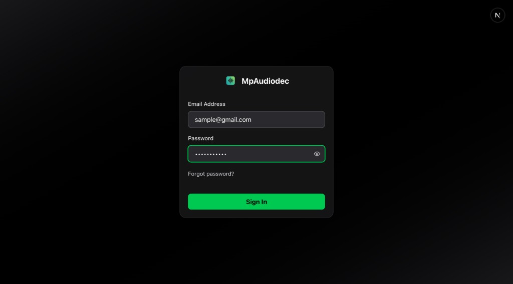
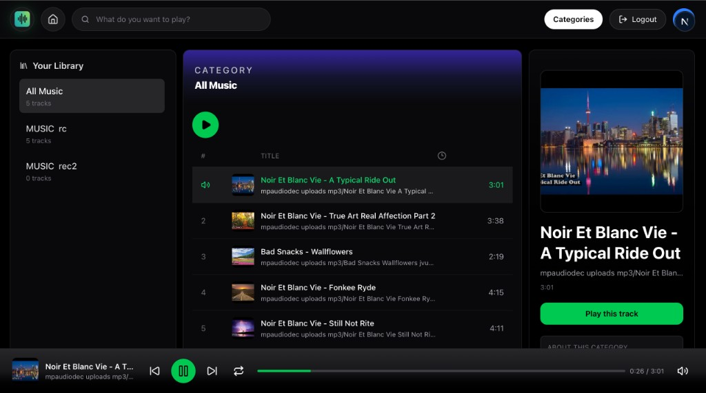
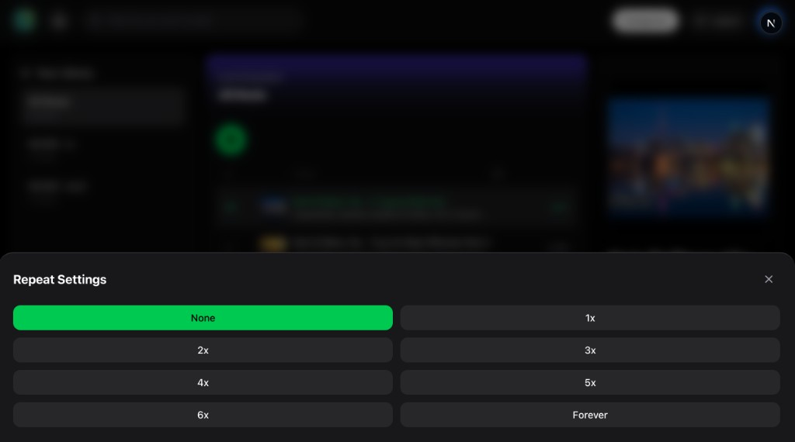

# mpaudiodec_web (Next.js)

Next.js App Router frontend with SSR + PWA, and server-side API proxy.

## Architecture

`Laravel API -> Next.js proxy (/api/upstream/*) -> Next.js SSR/UI`

## Run

```bash
npm install
npm run dev
```

## Build

```bash
npm run lint
npm run build
npm run start
```

## Screenshots

### Login



### Home Player



### Repeat Settings


